# 📚 YURead - AI-Powered Library Management System

<div align="center">


[](https://flutter.dev)
[](https://dotnet.microsoft.com/)
[](https://www.postgresql.org/)
[](https://www.docker.com/)
[](https://fastapi.tiangolo.com/)
[](LICENSE)

**Modern • AI-Powered • Microservices Architecture**

[Features](#-features) • [Architecture](#-architecture) • [Tech Stack](#-tech-stack) • [Getting Started](#-getting-started) • [Demo](#-demo)

</div>

---

## 🎯 Overview

**YURead** is a comprehensive library management platform designed for **Yeditepe University**, serving 1000+ potential users. It modernizes the traditional library experience through a microservices-based architecture, featuring AI-powered book recommendations, automated reservation systems, and real-time notifications.

### 🎬 Quick Links
- 🌐 **Live Demo**: [Coming Soon]
- 📹 **Video Walkthrough**: [Coming Soon]
- 📊 **Architecture Diagram**: [View Below](#architecture-overview)
- 📖 **API Documentation**: Available via Swagger on each service

---

## ✨ Features

### 🤖 AI-Powered Recommendations
- **Semantic Search**: Content-based filtering using SentenceTransformer embeddings (384D vectors)
- **Personalized Suggestions**: Top 5 book recommendations based on user favorites
- **Cosine Similarity**: ML-driven relevance matching with pre-computed embeddings

### 📚 Smart Library Management
- **Queue-Based Reservations**: FIFO system with automatic promotion when books become available
- **ETA Calculation**: Real-time estimated wait time based on queue position
- **Flexible Borrowing**: 1-2 week customizable borrow periods
- **Automatic Notifications**: Due date reminders, reservation updates, and system alerts

### 👥 Role-Based Access Control
- **Admin Interface**: Book management, user analytics, system statistics
- **User Interface**: Search, borrow, reserve, favorites, profile management
- **JWT Authentication**: Secure HS256 token-based auth with role claims

### 📱 Cross-Platform Mobile App
- **Flutter 3.7.2**: Native iOS, Android, and Web support
- **Provider State Management**: Reactive UI with ChangeNotifier pattern
- **Offline-First**: Local storage with SharedPreferences
- **Modern UI/UX**: Material Design with custom themes

---

## 🏗️ Architecture

### Microservices Overview

```mermaid
graph TB
    subgraph "Frontend Layer"
        Flutter[Flutter Mobile App<br/>iOS • Android • Web]
    end

    subgraph "API Gateway"
        Gateway[API Gateway<br/>Port: TBD]
    end

    subgraph "Microservices Layer"
        Auth[Auth Service<br/>:8080]
        Book[Book Service<br/>:8081]
        Borrow[Borrow Service<br/>:8082]
        Favorite[Favorite Service<br/>:8083]
        Reservation[Reservation Service<br/>:8084]
        Recommendation[Recommendation Service<br/>:8085 • Python]
        Notification[Notification Service<br/>:8086]
    end

    subgraph "Data Layer"
        AuthDB[(PostgreSQL<br/>Auth DB<br/>:5432)]
        BookDB[(PostgreSQL<br/>Books DB<br/>:5433)]
        BorrowDB[(PostgreSQL<br/>Borrow DB<br/>:5434)]
        FavoriteDB[(PostgreSQL<br/>Favorite DB<br/>:5435)]
        ReservationDB[(PostgreSQL<br/>Reservation DB<br/>:5436)]
        NotificationDB[(PostgreSQL<br/>Notification DB<br/>:5437)]
    end

    Flutter --> Gateway
    Gateway --> Auth
    Gateway --> Book
    Gateway --> Borrow
    Gateway --> Favorite
    Gateway --> Reservation
    Gateway --> Recommendation
    Gateway --> Notification

    Auth --> AuthDB
    Book --> BookDB
    Borrow --> BorrowDB
    Borrow -.->|Updates Availability| Book
    Borrow -.->|Promotes Reservation| Reservation
    Favorite --> FavoriteDB
    Reservation --> ReservationDB
    Recommendation -.->|Fetches Favorites| Favorite
    Recommendation -.->|Fetches Books| Book
    Notification --> NotificationDB
```



### Key Architecture Decisions

| Decision | Rationale |
|----------|-----------|
| **Microservices** | Independent deployment, scalability, and fault isolation |
| **Polyglot Persistence** | Each service owns its database (7 PostgreSQL instances) |
| **Event-Driven** | Async communication for cross-service workflows |
| **Containerization** | Docker Compose for consistent dev/prod environments |
| **JWT Authentication** | Stateless, scalable auth with role-based claims |

---

## 🛠️ Tech Stack

### Frontend
```yaml
Framework: Flutter 3.7.2
State Management: Provider 6.1.5
HTTP Client: http 1.4.0
Local Storage: shared_preferences 2.2.2
JWT Handling: jwt_decoder 2.0.1
Charts: fl_chart 1.0.0
Internationalization: intl 0.20.2
```

### Backend Services
```yaml
API Framework: ASP.NET Core 9.0 (.NET 9.0)
ORM: Entity Framework Core 9.0
Database: PostgreSQL 16
Authentication: JWT (HS256)
API Documentation: Swagger/OpenAPI
Logging: Console + Structured Logging
```

### AI/ML Service
```yaml
Framework: FastAPI (Python 3.x)
ML Library: SentenceTransformers
Model: all-MiniLM-L6-v2 (384D embeddings)
Similarity: Cosine Similarity (Scikit-learn)
Data Storage: JSON + Pickle (pre-computed embeddings)
```

### Infrastructure
```yaml
Containerization: Docker + Docker Compose
Networking: Bridge network (app-network)
Volumes: 6 persistent volumes for PostgreSQL data
Orchestration: Docker Compose v3
```

---

## 📊 System Metrics

| Metric | Value |
|--------|-------|
| **Microservices** | 7 independent services |
| **Databases** | 7 PostgreSQL instances |
| **API Endpoints** | 50+ RESTful endpoints |
| **ML Model Dimension** | 384D embeddings |
| **Book Embeddings** | 26,000+ pre-computed |
| **JWT Expiration** | 1 hour |
| **Reservation Window** | 7 days |
| **Borrow Duration** | 1-2 weeks (flexible) |

---

## 🚀 Getting Started

### Prerequisites

```bash
# Required Software
- Docker 24.0+
- Docker Compose 2.20+
- Flutter 3.7.2+ (for mobile development)
- .NET SDK 9.0+ (for service development)
- Python 3.9+ (for recommendation service)
```

### Installation

#### 1️⃣ Clone the Repository
```bash
git clone https://github.com/yusufkenanakgun/YURead.git
cd YURead
```

#### 2️⃣ Start All Services (Docker Compose)
```bash
# Build and start all microservices + databases
docker-compose up --build -d

# Check running containers
docker-compose ps

# View logs
docker-compose logs -f
```

#### 3️⃣ Initialize Databases
```bash
# Run database initialization scripts
docker exec -i postgres-auth psql -U postgres -d yuread_auth_db < database/auth_init.sql
docker exec -i postgres-books psql -U postgres -d yuread_books_db < database/books_init.sql
# Repeat for other databases...
```

#### 4️⃣ Setup Flutter Frontend
```bash
cd new_frontend

# Install dependencies
flutter pub get

# Run on emulator/device
flutter run

# Or build for production
flutter build apk --release  # Android
flutter build ios --release  # iOS
flutter build web --release  # Web
```

### Service URLs (Local Development)

| Service | URL | Swagger |
|---------|-----|---------|
| Auth Service | http://localhost:8080 | http://localhost:8080/swagger |
| Book Service | http://localhost:8081 | http://localhost:8081/swagger |
| Borrow Service | http://localhost:8082 | http://localhost:8082/swagger |
| Favorite Service | http://localhost:8083 | http://localhost:8083/swagger |
| Reservation Service | http://localhost:8084 | http://localhost:8084/swagger |
| Recommendation Service | http://localhost:8085 | http://localhost:8085/docs |
| Notification Service | http://localhost:8086 | http://localhost:8086/swagger |

---

## 📸 Screenshots

<div align="center">

### Mobile App Screens

| Login Screen | Home Screen | AI Recommendations |
|:------------:|:-----------:|:------------------:|
|  |  |  |

| Search | Book Details | Reservations |
|:------:|:------------:|:------------:|
|  |  |  |

### Admin Panel

| Book Management | User Statistics | Borrow Analytics |
|:---------------:|:---------------:|:----------------:|
|  |  |  |

</div>

---

## 🔄 Key Workflows

### 1. User Authentication Flow


### 2. Book Borrowing Flow


### 3. AI Recommendation Flow


### 4. Reservation Promotion Flow


---

## 📚 API Documentation

### Sample Endpoints

#### Authentication
```http
POST /api/auth/register
POST /api/auth/login
GET  /api/auth/users
DELETE /api/auth/{id}
```

#### Books
```http
GET    /api/books
GET    /api/books/{id}
POST   /api/books
PUT    /api/books/{id}
DELETE /api/books/{id}
PATCH  /api/books/{id}/availability
```

#### Borrowing
```http
GET    /api/borrow
GET    /api/borrow/{id}
POST   /api/borrow
PUT    /api/borrow/{id}/return
GET    /api/borrow/user/{username}
GET    /api/borrow/book/{bookId}
```

#### Favorites
```http
GET    /api/favorite
POST   /api/favorite
DELETE /api/favorite/{id}
GET    /api/favorite/by-user/{userId}
DELETE /api/favorite/user/{username}
```

#### Reservations
```http
GET    /api/reservation
POST   /api/reservation
DELETE /api/reservation/{id}
GET    /api/reservation/user/{username}
POST   /api/reservation/assign/{bookId}
```

#### Recommendations (FastAPI)
```http
GET    /recommendations/{user_id}
GET    /health
```

#### Notifications
```http
GET    /api/notification
POST   /api/notification
PUT    /api/notification/{id}/read
GET    /api/notification/user/{username}
```

---

## 🗂️ Project Structure

```
YURead/
├── services/                          # Microservices
│   ├── auth-service/                  # Authentication (Port 8080)
│   │   └── AuthService/
│   │       ├── Controllers/
│   │       ├── Models/
│   │       ├── Data/
│   │       ├── Program.cs
│   │       └── Dockerfile
│   ├── book-service/                  # Books Management (Port 8081)
│   ├── borrow-service/                # Borrowing Logic (Port 8082)
│   ├── favorite-service/              # Favorites (Port 8083)
│   ├── reservation-service/           # Reservations (Port 8084)
│   ├── recommendation-service/        # AI Recommendations (Port 8085)
│   │   ├── recommendation_service.py
│   │   ├── requirements.txt
│   │   └── Dockerfile
│   └── notification-service/          # Notifications (Port 8086)
│
├── new_frontend/                      # Flutter Mobile App
│   ├── lib/
│   │   ├── main.dart
│   │   ├── constants/
│   │   ├── models/
│   │   ├── services/
│   │   ├── providers/
│   │   ├── screens/
│   │   └── widgets/
│   ├── pubspec.yaml
│   └── README.md
│
├── database/                          # Database initialization scripts
│   ├── auth_init.sql
│   ├── books_init.sql
│   └── ...
│
├── shared/                            # Shared libraries (if any)
├── gateway/                           # API Gateway (future)
│
├── docker-compose.yml                 # Orchestration
├── books_with_embeddings.json         # ML embeddings data
├── book_embeddings.pkl                # Serialized embeddings
├── auto_user_recommend.py             # ML recommendation script
│
└── README.md                          # This file
```

---

## 🔐 Security Features

### Implemented
- ✅ **JWT Authentication**: HS256 token signing with role-based claims
- ✅ **BCrypt Password Hashing**: Industry-standard password encryption
- ✅ **CORS Configuration**: Cross-origin resource sharing enabled
- ✅ **Database Constraints**: Unique indexes to prevent duplicates
- ✅ **Input Validation**: Model validation on all endpoints

### Recommendations for Production
- 🔧 **Secret Management**: Use Azure Key Vault / AWS Secrets Manager
- 🔧 **Refresh Tokens**: Implement token renewal mechanism
- 🔧 **Rate Limiting**: Add API throttling (e.g., AspNetCoreRateLimit)
- 🔧 **HTTPS Only**: Enforce SSL/TLS in production
- 🔧 **API Gateway**: Implement with authentication middleware

---

## 🧪 Testing

### Running Tests (Coming Soon)
```bash
# Unit Tests
dotnet test services/auth-service/AuthService.Tests

# Integration Tests
dotnet test services/integration-tests

# Flutter Tests
cd new_frontend
flutter test
```

---

## 🚢 Deployment

### Docker Compose (Recommended for Local/Staging)
```bash
docker-compose up -d
```

### Production Deployment Options

#### Option 1: Railway.app
```bash
# Install Railway CLI
npm i -g @railway/cli

# Login and deploy
railway login
railway up
```

#### Option 2: Kubernetes (Advanced)
```bash
# Convert Docker Compose to Kubernetes manifests
kompose convert

# Deploy to cluster
kubectl apply -f deployments/
```

#### Option 3: Cloud Platforms
- **Azure App Service**: Deploy each microservice as separate App Service
- **AWS ECS/Fargate**: Container orchestration
- **Google Cloud Run**: Serverless containers

---

## 🤝 Contributing

We welcome contributions! Please follow these steps:

1. Fork the repository
2. Create a feature branch (`git checkout -b feature/amazing-feature`)
3. Commit your changes (`git commit -m 'Add amazing feature'`)
4. Push to the branch (`git push origin feature/amazing-feature`)
5. Open a Pull Request

### Code Style
- **C#**: Follow Microsoft C# Coding Conventions
- **Dart**: Use `dart format` before committing
- **Python**: Follow PEP 8

---

## 📝 License

This project is licensed under the **MIT License** - see the [LICENSE](LICENSE) file for details.

---

## 👥 Team

| Role | Name | GitHub |
|------|------|--------|
| **CSE Students** | Kaya Berk Karakelle | [@kayaberk](https://github.com/kayaberk) |
| | Yusuf Kenan Akgün | [@yusufkenanakgun](https://github.com/yusufkenanakgun) |
| | Sipan Açar | [@sipanacar](https://github.com/sipanacar) |
| | Osman Furkan Bayram | [@osmanfurkanbayram](https://github.com/osmanfurkanbayram) |
| | Ece Çarpıcı | [@ececarpici](https://github.com/ececarpici) |
| | Berfin Özdemir | [@berfinozdemir](https://github.com/berfinozdemir) |
| **ISE Students** | Damla Tatlısu | [@damlatatlisu](https://github.com/damlatatlisu) |
| | Gamze Binici | [@gamzebinici](https://github.com/gamzebinici) |

**Supervisor**: Yeditepe University Computer Science & Engineering Department

---

## 📞 Support

For questions, issues, or feature requests:
- 📧 Email: yusuf.akgun@std.yeditepe.edu.tr
- 🐛 Issues: [GitHub Issues](https://github.com/yusufkenanakgun/YURead/issues)
- 💬 Discussions: [GitHub Discussions](https://github.com/yusufkenanakgun/YURead/discussions)

---

## 🎯 Future Enhancements

### Planned Features
- [ ] **Book Feedback System**: User ratings and reviews
- [ ] **App Rating**: Collect overall satisfaction metrics
- [ ] **AI Book Assistant**: Chatbot for book discovery
- [ ] **Mobile Push Notifications**: Real-time alerts
- [ ] **Social Features**: Book clubs, reading challenges
- [ ] **Analytics Dashboard**: Advanced statistics for admins
- [ ] **API Gateway**: Centralized routing and auth
- [ ] **GraphQL Support**: Alternative API interface
- [ ] **WebSocket Notifications**: Real-time updates
- [ ] **Multi-Language Support**: i18n implementation

### Technical Roadmap
- [ ] **Service Mesh**: Istio/Linkerd integration
- [ ] **Distributed Tracing**: OpenTelemetry
- [ ] **Circuit Breaker**: Polly resilience patterns
- [ ] **Event Sourcing**: CQRS implementation
- [ ] **Redis Caching**: Performance optimization
- [ ] **Elasticsearch**: Advanced search capabilities

---

## 📊 Performance Metrics

| Metric | Target | Current |
|--------|--------|---------|
| API Response Time | < 200ms | ✅ Achieved |
| Database Query Time | < 50ms | ✅ Achieved |
| ML Recommendation | < 500ms | ✅ Achieved |
| Mobile App Launch | < 2s | ✅ Achieved |
| Docker Build Time | < 5 min | ✅ Achieved |

---

## 🙏 Acknowledgments

- **Yeditepe University** for project support
- **SentenceTransformers** community for ML models
- **Flutter** and **ASP.NET Core** teams for excellent frameworks
- **PostgreSQL** for robust database system

---

<div align="center">

**Made with ❤️ by YURead Team**

⭐ Star this repo if you find it helpful!

[Report Bug](https://github.com/yusufkenanakgun/YURead/issues) · [Request Feature](https://github.com/yusufkenanakgun/YURead/issues)

</div>
